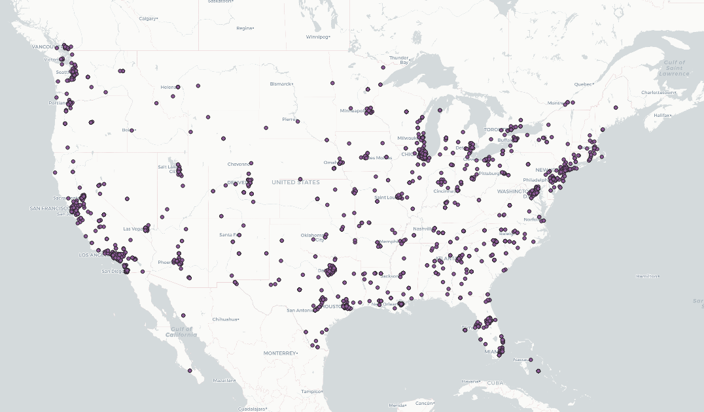
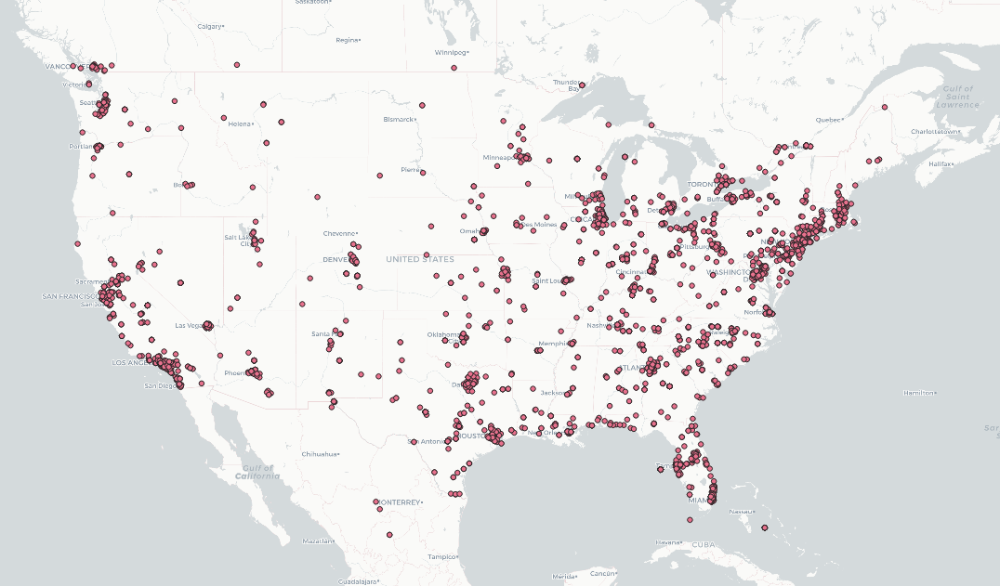
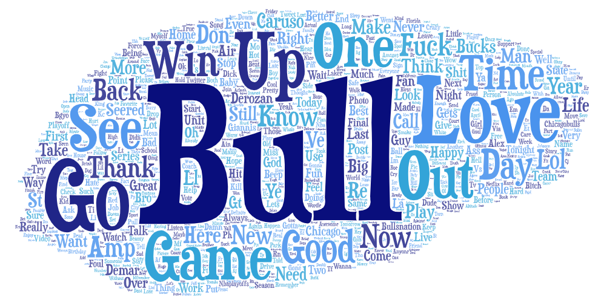
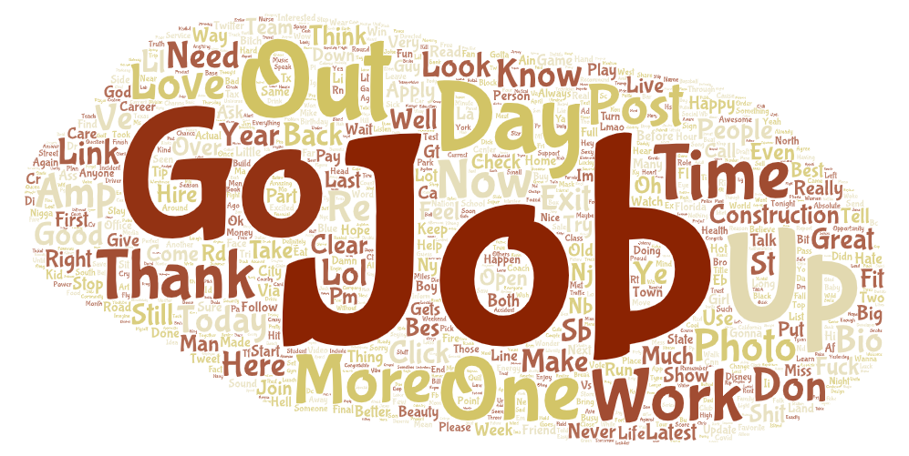

# Project: Geotagged Tweets

This project looks at geotagged tweets from two different time periods in the United States. The first was taken on April 20th at 11:49pm PST, and the second was captured midday on April 21st at 11:32am PST. I chose these two periods in order to see how tweets change in content during the day compared to later at night. Both snapshots were taken from tweets in a 10 minute duration occuring within the United States that were written in english. Another factor that remained consistent between both time periods was them both occuring during the work week rather than during the weekend.

---
## Tweet Locations
### Map 1 - April 20th, 11:49pm - 11:59pm PST

### Map 2 - April 21st, 11:32am - 11:42am PST

Despite being taken only 12 hours appart, these maps show contrasting levels of activity based on geographical region. One main difference between the two maps is the level of activity on the East Coast in Map 2 compared to Map 1. One explanation for this is the difference in timezones between the West and East Coast. Another explanation for this difference could be that users on the East Coast would be finishing work before the users on the West Coast, leading to more activity in Map 2 in the East Coast compared to Map 1.

---
## Tweet Contents

### Word Cloud 1 - April 20th, 11:49pm - 11:59pm PST

### Word Cloud 2 - April 21st, 11:32am - 11:42am PST

When analyzing the content of the tweets posted during these two time periods, there are some big differences. In Word Cloud 1, words such as "Bull", "Win", "Game", "Up", and "Bucks" are from tweets talking about the Chicago Bulls game that happened on April 20th. The focus of alot of these tweets were based on leisure activities such as watching the basketball game. In comparison, Word Cloud 2 reflects users currently at work during the day. Words like "Job" and "Work" represent this current state.
